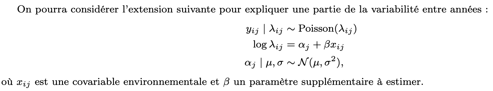

# Partie Modele Extension 

::: {#fig-model}
{width="90%" fig-align="center"}
:::

Variante : sigma^2 suit une loi Exponentielle(1), mu suit loi Gaussien(0,4), Belta suit loi Gaussien(0,10).

Reparamétrisation : gamma = log(sigma^2), Z_i = log(lambda_i)

Il y a 5 fonction. Ce sont: 

- fonction log_posterior_ext : calculer la log posterior
- fonction les gradients : calculer les gradients de -log_postierior par les parametres Zi, mu, sigma, Belta
- fonction leapfrog_ext  : calculer les steps pour algo HMC
- fonction HMC_step_ext  : algo HMC
- fonction run_chain_ext : pour faire des chaines en même temps
- fonction get_temp_site  : Récupérer et calculer les températures moyennes annuelles.

Dans cette partie, nous avons exploité les coordonnées des sites afin de récupérer các données de température via la NASA en utilisant le package "nasapower". Malheureusement, ce package ne fournit plus các températures annuelles directes, mais seulement các données mensuelles. Par conséquent, nous các avons récupérées và calculé "à la main" các moyennes annuelles.(T2M)


```{r}
# ------------------------------------------------------------------------------
#                   CHARGEMENT ET PRÉ-TRAITEMENT DES DONNÉES
# ------------------------------------------------------------------------------
library(rgbif)
library(dplyr)
library(sf)
library(maps)

tigre_moustique_data <- occ_search(
  scientificName = "Aedes albopictus",
  country = "FR",
  limit = 2210,
)$data

# ------------------------------------------------------------------------------
#                   RESUME DES DONNÉES
summary_table <- tigre_moustique_data %>%
  filter(!is.na(year), !is.na(stateProvince)) %>%  
  group_by(year, stateProvince) %>%                 
  summarise(n_occurrences = n(), .groups = "drop") 

# Extraction des coordonnées moyennes (centroïdes) de chaque province à partir des données brutes
sites_coords <- tigre_moustique_data %>%
  filter(!is.na(stateProvince), !is.na(decimalLongitude), !is.na(decimalLatitude)) %>%
  group_by(stateProvince) %>%
  summarise(
    X = mean(decimalLongitude, na.rm = TRUE),
    Y = mean(decimalLatitude, na.rm = TRUE),
    .groups = "drop"
  )

# Vérification du nombre de provinces (doit être égal à 23)
print(nrow(sites_coords))
```

# Récuperer les données pour la covariable environnementale Xij

```{r}
get_temp_site <- function(lon, lat) {
  # 1. Récupération des données depuis l'API NASA POWER
  data <- get_power(
    community = "ag",lonlat = c(lon, lat),pars = "T2M", 
    dates = c("2014-01-01", "2025-12-31"),
    temporal_api = "monthly"
  )
  
  # 2. Traitement pour calculer la moyenne annuelle selon la structure de la table retournée
  if ("T2M" %in% colnames(data)) {
    # CAS 1 : Format "Long" (la colonne T2M est déjà présente)
    data_yearly <- data %>%
      group_by(YEAR) %>%
      summarise(
        T2M = mean(T2M, na.rm = TRUE),
        .groups = "drop"
      )
  } else {
    # CAS 2 : Format "Wide" (les mois sont dans des colonnes séparées : JAN, FEB...)
    month_cols <- intersect(c("JAN", "FEB", "MAR", "APR", "MAY", "JUN", 
                              "JUL", "AUG", "SEP", "OCT", "NOV", "DEC"), 
                            colnames(data))
    
    data_yearly <- data %>%
      mutate(T2M = rowMeans(select(., all_of(month_cols)), na.rm = TRUE)) %>%
      select(YEAR, T2M)
  }
  
  # 3. Réaffectation des coordonnées pour conserver l'information géographique lors de la fusion
  data_yearly$LON <- lon
  data_yearly$LAT <- lat
  
  return(data_yearly)
}
```


```{r}
library(nasapower)
library(sf)
library(dplyr)

# Initialisation d'une liste pour stocker les données de température
all_temps <- list()

for(i in 1:nrow(sites_coords)) {
  # Message de suivi dans la console
  message("Récupération des températures pour le département : ", 
          sites_coords$stateProvince[i], " (", i, "/23)...")
  
  # Appel de la fonction get_temp_site pour obtenir les données (vérification T2M incluse)
  temp_data <- get_temp_site(sites_coords$X[i], sites_coords$Y[i])
  
  # Ajout du nom du département pour faciliter la fusion ultérieure des données (Join)
  temp_data$stateProvince <- sites_coords$stateProvince[i]
  
  # Stockage dans la liste
  all_temps[[i]] <- temp_data
  
  # Pause pour respecter les limites de l'API NASA POWER
  Sys.sleep(0.5) 
}
```

```{r}
# Fusion des résultats dans un tableau (data.frame) final
df_temp_final <- bind_rows(all_temps)
df_temp_final
```

```{r}
# Fusion des données de température avec la table récapitulative (summary_table)
final_data_for_model <- summary_table %>%
  left_join(df_temp_final, by = c("year" = "YEAR", "stateProvince" = "stateProvince")) %>%
  filter(!is.na(T2M))
# Standardisation de la température (X_ij) pour le modèle de Poisson (centrage et réduction)
final_data_for_model$X_ij <- as.numeric(scale(final_data_for_model$T2M))

# 1. Tri des données pour garantir que l'ordre des Z_j corresponde à site_idx
final_data_for_model <- final_data_for_model %>% 
  arrange(stateProvince, year)

# 2. Vecteur de la variable dépendante (Nombre d'occurrences de moustiques)
Y_ext <- final_data_for_model$n_occurrences 

# 3. Vecteur de la variable indépendante (Température standardisée X_ij)
X_ext <- final_data_for_model$X_ij

# 4. Vecteur d'indice des sites (Crucial pour la correspondance avec Z_j)
# Génère un vecteur de type : 1, 1, 1... (12 fois), 2, 2, 2... (12 fois), etc.
site_idx <- as.numeric(factor(final_data_for_model$stateProvince))

# Affichage du nombre total d'observations prêtes pour le modèle
cat("Nombre final d'observations introduites dans le modèle :", length(Y_ext), "\n")
```

# La fonction de log-posteriori 

```{r}
# ------------------------------------------------------------------------------
#               La fonction log-postérieure (Version Extension)
# ------------------------------------------------------------------------------

log_posterior_ext <- function(Z, beta, Y, X, site_idx, mu, gamma) { 
  sigma2 <- exp(gamma)
  
  # --- Terme 1 : Log-Vraisemblance de Poisson ---
  # log_lambda = Z_j + beta * X_ij
  # Z[site_idx] permet d'affecter le bon Z_j à chaque ligne d'observation
  log_lambda <- Z[site_idx] + beta * X
  
  # Formule de la log-vraisemblance : sum(y * log_lambda - exp(log_lambda))
  # (On omet log(y!) car c'est une constante)
  log_vrais <- sum(Y * log_lambda - exp(log_lambda))
  
  # --- Terme 2 : Loi a priori conditionnelle des Zj (Loi Normale) ---
  # Z_j ~ N(mu, sigma2) pour les 23 sites
  log_prior_Z <- sum(dnorm(Z, mean = mu, sd = sqrt(sigma2), log = TRUE))
  
  # --- Terme 3 : Loi a priori de beta ---
  # beta ~ N(0, 10) -> sd = sqrt(10)
  log_prior_beta <- dnorm(beta, mean = 0, sd = sqrt(10), log = TRUE)
  
  # --- Terme 4 : Lois a priori de μ et σ2 ---
  # Prior pour la moyenne globale mu
  log_prior_mu <- dnorm(mu, mean = 0, sd = 2, log = TRUE)
  
  # Prior pour sigma2 (Loi Exponentielle)
  # Note : dexp(sigma2...) + gamma inclut l'ajustement du Jacobien 
  # pour le changement de variable gamma = log(sigma2)
  log_prior_sigma2 <- dexp(sigma2, rate = 1, log = TRUE) + gamma 
  
  # --- Somme Totale (Log-Posteriori) ---
  res <- log_vrais + log_prior_Z + log_prior_beta + log_prior_mu + log_prior_sigma2
  
  # Vérification de la stabilité numérique
  if (is.na(res) || is.infinite(res)) return(-1e20) 
  
  return(res)
}
```


# Les fonctions de gradients 

```{r}
# ------------------------------------------------------------------------------
#       Gradient de l'Énergie Potentielle U(theta) = -log_posterior
# ------------------------------------------------------------------------------
# Calcul du gradient de l'énergie (nabla U) pour l'algorithme HMC.
# Rappel : U = -log(pi(theta|y)), nous implémentons ici les dérivées 
# partielles analytiques obtenues précédemment.
# ------------------------------------------------------------------------------

grad_Z_ext <- function(Z, beta, Y, X, site_idx, mu, gamma) {
  sigma2 <- exp(gamma)
  
  # Calcul de lambda pour l'ensemble des 276 observations
  log_lambda <- Z[site_idx] + beta * X
  lambda <- exp(log_lambda)
  
  # Erreur (Espérance - Observation)
  error <- lambda - Y
  
  # Agrégation des erreurs par site (somme de lambda_ij - Y_ij pour chaque site j)
  # On utilise tapply pour réduire les 276 lignes aux 23 sites
  grad_lik_Z <- as.numeric(tapply(error, site_idx, sum))
  
  # Dérivée de la loi a priori (Prior) N(mu, sigma2)
  grad_prior_Z <- (Z - mu) / sigma2
  
  return(grad_lik_Z + grad_prior_Z)
}

grad_beta <- function(Z, beta, Y, X, site_idx) {
  log_lambda <- Z[site_idx] + beta * X
  lambda <- exp(log_lambda)
  
  # Dérivée de la log-vraisemblance par rapport à beta : sum(X_ij * (lambda_ij - Y_ij))
  grad_lik_beta <- sum(X * (lambda - Y))
  
  # Dérivée de la loi a priori beta ~ N(0, 10) : beta / 10
  grad_prior_beta <- beta / 10
  
  return(grad_lik_beta + grad_prior_beta)
}

grad_mu_ext <- function(Z, mu, gamma) {
  sigma2 <- exp(gamma)
  # Dérivée issue du prior de Z + dérivée du prior de mu lui-même (mu ~ N(0, 4))
  return(sum(mu - Z) / sigma2 + mu / 4)
}

grad_gamma_ext <- function(Z, mu, gamma) {
  sigma2 <- exp(gamma)
  I <- length(Z) # I = 23
  # Dérivée par rapport à gamma = log(sigma2), incluant la correction du Jacobien
  return(-sum((Z - mu)^2) / (2 * sigma2) + I / 2 + sigma2 - 1)
}
```

# Algorithme Hamilton Monte Carlo avec methode leapfrog 

```{r}
leapfrog_ext <- function(Z, beta, mu, gamma, P_Z, P_beta, P_mu, P_gamma, Y, X, site_idx, eps, L, f_grad_Z, f_grad_beta, f_grad_mu, f_grad_gamma) {
  
  # Premier demi-pas pour les impulsions (Momentum half-step)
  P_Z     <- P_Z     - 0.5 * eps * f_grad_Z(Z, beta, Y, X, site_idx, mu, gamma)
  P_beta  <- P_beta  - 0.5 * eps * f_grad_beta(Z, beta, Y, X, site_idx)
  P_mu    <- P_mu    - 0.5 * eps * f_grad_mu(Z, mu, gamma)
  P_gamma <- P_gamma - 0.5 * eps * f_grad_gamma(Z, mu, gamma)
  
  for (l in 1:L) {
    # Mise à jour des positions (Position update)
    Z     <- Z     + eps * P_Z
    beta  <- beta  + eps * P_beta
    mu    <- mu    + eps * P_mu    
    gamma <- gamma + eps * P_gamma 
    
    if (l < L) {
      # Mise à jour complète des impulsions (sauf pour le dernier pas)
      P_Z     <- P_Z     - eps * f_grad_Z(Z, beta, Y, X, site_idx, mu, gamma)
      P_beta  <- P_beta  - eps * f_grad_beta(Z, beta, Y, X, site_idx)
      P_mu    <- P_mu    - eps * f_grad_mu(Z, mu, gamma)
      P_gamma <- P_gamma - eps * f_grad_gamma(Z, mu, gamma)
    }
  }
  
  # Dernier demi-pas pour les impulsions (Final momentum half-step)
  P_Z     <- P_Z     - 0.5 * eps * f_grad_Z(Z, beta, Y, X, site_idx, mu, gamma)
  P_beta  <- P_beta  - 0.5 * eps * f_grad_beta(Z, beta, Y, X, site_idx)
  P_mu    <- P_mu    - 0.5 * eps * f_grad_mu(Z, mu, gamma)
  P_gamma <- P_gamma - 0.5 * eps * f_grad_gamma(Z, mu, gamma)
  
  return(list(Z = Z, beta = beta, mu = mu, gamma = gamma, P_Z = P_Z, P_beta = P_beta, P_mu = P_mu, P_gamma = P_gamma))
}

HMC_step_MC_ext <- function(Z, beta, mu, gamma, Y, X, site_idx, eps, L, lp_func, f_grad_Z, f_grad_beta, f_grad_mu, f_grad_gamma) {
  
  # 1. Initialisation des impulsions aleatoire
  P_Z_init     <- rnorm(length(Z))
  P_beta_init  <- rnorm(1)
  P_mu_init    <- rnorm(1)
  P_gamma_init <- rnorm(1)
  
  # 2. Calcul de l'énergie initiale (Hamiltonien initial)
  init_U <- -lp_func(Z, beta, Y, X, site_idx, mu, gamma)
  init_K <- sum(P_Z_init^2)/2 + P_beta_init^2/2 + P_mu_init^2/2 + P_gamma_init^2/2
  
  # 3. Leapfrog
  res <- leapfrog_ext(Z, beta, mu, gamma, P_Z_init, P_beta_init, P_mu_init, P_gamma_init, Y, X, site_idx, eps, L, f_grad_Z, f_grad_beta, f_grad_mu, f_grad_gamma)
  
  # 4. Calcul de l'énergie finale (Hamiltonien final)
  final_U <- -lp_func(res$Z, res$beta, Y, X, site_idx, res$mu, res$gamma)
  final_K <- sum(res$P_Z^2)/2 + res$P_beta^2/2 + res$P_mu^2/2 + res$P_gamma^2/2
  
  # 5. Accept/Reject
  if (log(runif(1)) < (init_U + init_K - final_U - final_K)) {
    return(list(Z = res$Z, beta = res$beta, mu = res$mu, gamma = res$gamma, accepted = TRUE))
  } else {
    return(list(Z = Z, beta = beta, mu = mu, gamma = gamma, accepted = FALSE))
  }
}

run_chain_ext <- function(id, n_iter, Y, X, site_idx, eps, L) {
  # 1. Initialisation Empirique (Pour favoriser la convergence)
 
  # Calcul de la moyenne par site pour mồi (moyenner sur les années)
  # Correction : on utilise Y (l'argument de la fonction) et non Y_ext (variable globale)
  Y_mean_site <- as.numeric(tapply(Y, site_idx, mean))
  
  # Initialisation de Z (log-moyenne par site)
  curr_Z      <- log(Y_mean_site + 0.1)
  
  # Initialisation de beta (effet neutre au départ)
  curr_beta   <- 0
  
  # Initialisation des hyperparamètres (mu et gamma)
  curr_mu     <- mean(curr_Z)
  curr_gamma  <- log(var(curr_Z))
  
  # 2. Sauvegarde des échantillons (Traces)
  beta_trace  <- numeric(n_iter)
  mu_trace    <- numeric(n_iter)
  sigma_trace <- numeric(n_iter)
  Z_trace     <- matrix(0, n_iter, 23) 
  accepted_count_ext <- 0
  
  # 3. Boucle MCMC (Algorithme HMC)
  for (k in 1:n_iter) {
    res <- HMC_step_MC_ext(curr_Z, curr_beta, curr_mu, curr_gamma, Y, X, site_idx, eps, L, 
                           lp_func = log_posterior_ext, 
                           f_grad_Z = grad_Z_ext, 
                           f_grad_beta = grad_beta,
                           f_grad_mu = grad_mu_ext, 
                           f_grad_gamma = grad_gamma_ext)
    
    # Mise à jour des valeurs actuelles
    curr_Z     <- res$Z
    curr_beta  <- res$beta
    curr_mu    <- res$mu
    curr_gamma <- res$gamma
    
    if (res$accepted) {
      accepted_count_ext <- accepted_count_ext + 1
    }
    
    # Enregistrement dans les traces
    beta_trace[k]  <- curr_beta
    mu_trace[k]    <- curr_mu
    sigma_trace[k] <- sqrt(exp(curr_gamma))
    Z_trace[k, ]   <- curr_Z
    
    # Affichage de la progression et du taux d'acceptation
    if (k %% max(1, floor(n_iter / 10)) == 0) {
      current_acc_rate <- (accepted_count_ext / k) * 100 
      cat(sprintf("  Chaîne %d | Progression : %d / %d (%d%%) | Taux d'acc. : %.1f%%\n", 
                  id, k, n_iter, round(k/n_iter*100), current_acc_rate))
    }
  }
  
  final_acc_rate_ext <- (accepted_count_ext / n_iter) 
  cat(sprintf("=> Chaîne %d terminée avec succès. Taux d'acceptation final : %.2f%%\n", 
              id, final_acc_rate_ext * 100))
  
  return(list(mu = mu_trace, sigma = sigma_trace, beta = beta_trace, Z = Z_trace, acc_rate = final_acc_rate_ext))
}
```

# Main 

```{r}
# ------------------------------------------------------------------------------
#           Main : Lancement de la Simulation MCMC (Version Extension)
# ------------------------------------------------------------------------------

# Paramètres de simulation
n_chains <- 1 ; n_iter <- 5000; eps <- 0.01; L<- 100 

# Liste pour stocker les résultats de chaque chaîne
all_results_ext <- list()

set.seed(42) 

for (i in 1:n_chains) {
  cat(sprintf("\n--- Démarrage de la Chaîne %d ---", i))
  cat(sprintf("\nConfiguration : n_iter = %d, eps = %.4f, L = %d\n", n_iter, eps, L))
  
  start_time <- Sys.time()
  
  # Appel de la fonction de simulation
  # Note : Y_ext et X_ext doivent être définis au préalable
  all_results_ext[[i]] <- run_chain_ext(id = i, n_iter = n_iter, Y = Y_ext, 
    X = X_ext, site_idx = site_idx, eps  = eps,  L = L)
  
  end_time <- Sys.time()
  duration <- as.numeric(end_time - start_time, units="mins")
  
  cat(sprintf("=> Chaîne %d terminée en %.2f minutes.\n", i, duration))
}
```

# Les Résultats

```{r}
par(mfrow=c(2,2))

# Visualisation des paramètres globaux (Mu et Sigma) - Chaîne 1

# --- ANALYSE DE MU (Moyenne globale des log-intensités) ---
mu_trace_ext <- all_results_ext[[1]]$mu
plot(mu_trace_ext, type="l" ,col="darkcyan", main="Traceplot mu")
hist(mu_trace_ext, col="darkcyan",main="Posterior mu")
# --- ANALYSE DE SIGMA (Écart-type de la variabilité interannuelle) ---
sigma_trace2_ext <- all_results_ext[[1]]$sigma
plot(sigma_trace2_ext, type="l",col="darkblue", main="Traceplot sigma")
hist(sigma_trace2_ext,col="darkblue", main="Posterior sigma")

```


```{r}
# Export les resultats de chaine 1
beta_samples <- all_results_ext[[1]]$beta

# 2. Calcule le moyen, mean, sd, Ic
beta_mean <- mean(beta_samples)
beta_sd   <- sd(beta_samples)
beta_CI   <- quantile(beta_samples, probs = c(0.025, 0.975)) # Intervalle de Confiance 95%
beta_median <- median(beta_samples)

# 3. Met dans un tableau
res_beta <- data.frame(
  Paramètre = "Beta (Température Xij)",
  Estimate = round(beta_mean, 4),
  Std.Error = round(beta_sd, 4),
  Lower_CI_95 = round(beta_CI[1], 4),
  Upper_CI_95 = round(beta_CI[2], 4),
  Median = round(beta_median, 4)
)

print("--- Résumé des estimations pour la covariable environnementale ---")
print(res_beta)
```

```{r}
library(ggplot2)

ggplot(data.frame(beta = beta_samples), aes(x = beta)) +
  geom_density(fill = "steelblue", alpha = 0.4) +
  geom_vline(aes(xintercept = beta_mean), color = "darkblue", linetype = "solid", size = 1) +
  geom_vline(aes(xintercept = 0), color = "red", linetype = "dashed") +
  annotate("text", x = beta_mean, y = 0.5, label = paste("Mean =", round(beta_mean, 3)), color = "darkblue") +
  labs(
    title = "Distribution Postérieure de Beta (Chaîne 1)",
    subtitle = "Effet de la température (Xij) sur la présence des moustiques",
    x = "Valeur de Beta",
    y = "Densité"
  ) +
  theme_minimal()
```

```{r}
# sigma du modèle précédent (calculé dans la section précédente)
sigma_old <- 1.042131

# sigma du nouveau modèle (Extension avec covariable)
sigma_new <- mean(all_results_ext[[1]]$sigma)

# Affichage des résultats
cat(sprintf("Moyen de σ^2  sans l'effet de la température : %.3f\n", sigma_old))
cat(sprintf("Moyen de σ^2  après inclusion de la température (Xij) : %.3f\n", sigma_new))
```


```{r}
# mu du modèle précédent (calculé dans la section précédente)
mu_old <- 1.391148

# mu du nouveau modèle (Extension avec covariable)
mu_new <- mean(all_results_ext[[1]]$mu)

# Affichage des résultats pour la moyenne globale
cat(sprintf("Moyenne de μ sans l'effet de la température : %.3f\n", mu_old))
cat(sprintf("Moyenne de μ après inclusion de la température (Xij) : %.3f\n", mu_new))
```


```{r}
# Transformation des paramètres et construction de la matrice finale
# ------------------------------------------------------------------------------

Z_trace2 <- all_results_ext[[1]]$Z
Z_samples2 <- Z_trace2
λ_samples2 <- exp(Z_samples2)
mu_trace <- all_results_ext[[1]]$mu
sigma_trace <-all_results_ext[[1]]$sigma
beta_samples <- all_results_ext[[1]]$beta

# Regroupement des Lambda (12 colonnes), de Mu et de Sigma
samples_matrix2 <- cbind(λ_samples2, mu_trace, sigma_trace, beta_samples )
n_l <- ncol(λ_samples2)
colnames(samples_matrix2) <- c(paste0("λ", 1:n_l), "μ", "σ^2","beta")

head(round(samples_matrix2,5))
```


```{r}
# Eliminer 1000 premiere ligne 
clean_samples2 <- samples_matrix2[1001:5000, ]

# 1.Posterior Mean)
post_mean2 <- colMeans(clean_samples2)

# 2. Interval de confiances 95% (95% Credible Interval)
post_ci2 <- apply(clean_samples2, 2, quantile, probs = c(0.025, 0.975))

# 3. Met dans un tableau 
results2 <- data.frame(
  Parameter = colnames(clean_samples2),
  Estimate = post_mean2,
  CI_lower = post_ci2[1, ],
  CI_upper = post_ci2[2, ]
)

print(results2)
```